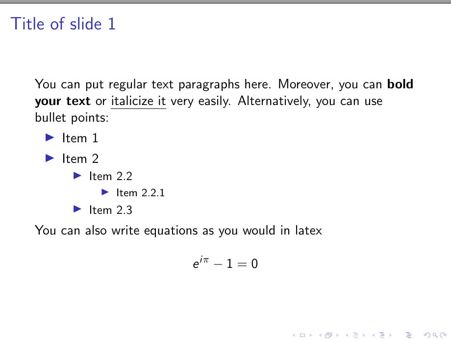

# markdown-pdf

Easily generate PDFs for presentations using latex through markdown

To build, you will need a semi-recent version of `rustc`. See [here](https://www.rust-lang.org/tools/install)
for installation instructions. Using `git`, clone the repository:

```
git clone https://github.com/VanillaBrooks/markdown-pdf --depth 1
cd markdown-pdf
```

Then, build the project with `cargo`:

```
cargo build --release
```

## Running
Run the project by either entering `markdown-pdf/target/release/` and using the `markdown-pdf` binary
directly, or use `cargo` in the project root:

```
cargo r -- </path/to/your/markdown.md> <path/to/your/output/dir>
cargo r -- example/example.md example/
```

After generating a `.tex` file from your markdown you can compile it to a pdf with `pdflatex` and a `.pdf` will
be generated for the presentation:

```
pdflatex your_file.tex
```


## Exmaple

The following is a sample markdown file that compiles to latex:

```
# Presentation
AUTHOR=Your Name Here

## Title of slide 1

You can put regular text paragraphs here. Moreover, you can **bold your text** or *italicize it* very
easily. Alternatively, you can use bullet points:

* Item 1
* Item 2
    * Item 2.2
        * Item 2.2.1
    * Item 2.3

You can also write equations as you would in latex

$$
e^{i \pi} - 1 = 0
$$


## Title Slide 2


## Pictures with text are automatically vertically split

When you have a picture with text on the same slide, the area is automatically split.

* Margins can easily be adjusted in .tex file


```

Now, run it through `markdown-pdf` and `pdflatex`:

```
cargo r -- example/example.md example/
pdflatex example/example.tex
```

The following is generated in PDF form:





The generated `.tex` file is also available in `./examples`.

## Why?
Writing these documents in markdown is far easier that writing in a latex editor. Take the bullet points from the example:

```
* Item 1
* Item 2
    * Item 2.2
        * Item 2.2.1
    * Item 2.3
```

These 5 lines of markdown are transpiled to the following `tex`:

```
\begin{itemize}
    \item Item 1
    \item Item 2

    \begin{itemize}
		\item Item 2.2

        \begin{itemize}
            \item Item 2.2.1
        \end{itemize}
            \item Item 2.3
    \end{itemize}
\end{itemize}
```

which is just cumbersome to write all the time. Instead `markdown-pdf` allows for coarse generation of a `tex`
file that can then be fine-tuned to the exact desired layout.

