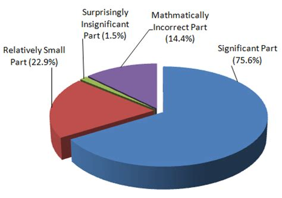

# Presentation
AUTHOR=Your Name Here

## Title of slide 1

You can put regular text paragraphs here. Moreover, you can **bold your text** or *italicize it* very
easily. Alternatively, you can use bullet points:

* Item 1
* Item 2
    * Item 2.2
        * Item 2.2.1
    * Item 2.3

You can also write equations as you would in latex

$$
e^{i \pi} - 1 = 0
$$

## Title Slide 2

## Pictures with text are automatically vertically split

When you have a picture with text on the same slide, the area is automatically split.

* Margins can easily be adjusted in .tex file

